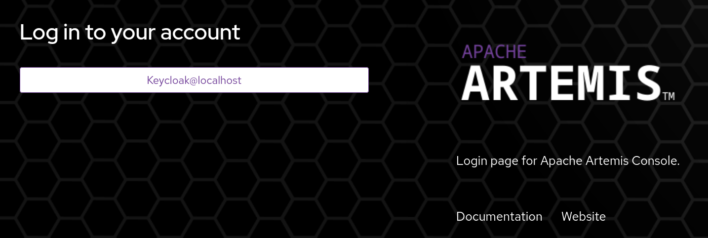

# JMS Security OpenID Connect Example

If you have not already done so, [prepare the broker distribution](../../../../README.md#getting-started) before running the example.

This example is a fully rewritten version of previous example which worked only with https://www.keycloak.org[Keycloak server].
Here's a list of important changes and differences:

 - While the example uses Keycloak as an OpenID Connect provider, after minimal configuration changes this example should also work with other providers and there's no need to use any dedicated Keycloak (or other) libraries
 - This example obtains a JWT access token itself, and no password is sent to Artemis Broker
 - There are 3 (instead of 2) OpenID Connect _clients_ used (more on that later)

There are two main parts of this readme file. In the first one we'll simply show how to run and experiment with the example. Second
part contains more details about the underlying technology (OAuth2 and OpenID Connect).

## Components used in the example

There are four components involved when running this example:

- Artemis Broker - acts a server that allows accessing _resources_ like addresses/queues. Both a browser application (the console using HTTP protocol) and non-browser applications (messaging clients using messaging protocols like AMQP) access the broker
- Artemis Console - a web application which allows human operators to access the broker
- Messaging client using JMS API - Java example which accesses Artemis Broker without human interaction
- OAuth2/OpenID Connect provider (in this example - Keycloak server) - a component that issues access tokens and is trusted by the Artemis Server, Artemis Console and the messaging client

## Running the example

To run the example, simply type **mvn verify** from this directory, or **mvn -PnoServer verify** if you want to start and create the broker manually.

`verify` is the last Maven phase before `install` and involves all previous phases that lead to a phase where integration tests are run.

Maven build performs additional steps in `pre-integration-test` phase:

1. Specified Keycloak distribution archive is downloaded and unpacked (unless `-DskipDownloadKc` is used)
2. Artemis broker instance is created in `target/server0`

During `verify phase`:

1. Keycloak server is started asynchronously, but we await for a configured amount of time before starting the broker
2. Previously created broker instance is started
3. The example `org.apache.activemq.artemis.jms.example.OIDCSecurityExample` is run
4. Broker instance is stopped
4. Keycloak server is stopped

### How does `OIDCSecurityExample` work?

There's nothing special when using JWT token as credentials. JMS API doesn't know the concept of a _token_, so the only
place to pass a token is the `password` field.
Discussion on the evolution of JMS API is beyond the scope of this example.

Here's what the example is doing:

1. Waiting for Keycloak server going online (http://localhost:8080/realms/artemis-keycloak-demo/.well-known/openid-configuration can be reached)
2. `Info` queue and proper `javax.jms.ConnectionFactory` is obtained from JNDI
3. JWT access token is obtained using JDK HTTP Client from a [token endpoint](http://localhost:8080/realms/artemis-keycloak-demo/protocol/openid-connect/token)
4. The JWT access token is passed as `password` to `javax.jms.ConnectionFactory.createConnection()` method
5. `javax.jms.MessageConsumer.receive()` is called awaiting for a message to become available.

JWT token is obtained from Keycloak using `artemis-client` OIDC client.

While the example awaits for any message to be available in `Info` queue, user needs to log into Artemis Console.

When browsing to http://localhost:8161/console/artemis a login screen will be presented:



There's only one login option which uses OpenID Connect "Standard Flow". Artemis Console is based on [Hawtio console](https://hawt.io/) and OIDC authentication is configured using [hawtio-oidc.properties](src/main/resources/activemq/server0/hawtio-oidc.properties) file (more on that later).

Clicking the "Keycloak@localhost" button redirects the user to Keycloak authentication screen and we can enter actual user credentials for one of these available users:

 - `mdoe` with `password` password - this user has `guest` role of `artemis-console` client assigned
 - `jdoe` with `password` password - this user doesn't have `guest` role from `artemis-console` client assigned

Artemis Console is configured with `HAWTIO_ROLES='guest'` and `hawtio-oidc.properties` contains:

    oidc.rolesPath = resource_access.artemis-console.roles

It means that only a user which has `guest` role local to `artemis-console` OIDC client (not a global role in Keycloak) can log in to the console.

After successfully logging in as `mdoe`, user needs to:

1. Go to Artemis tab on the left (if not selected by default)
2. Go to Queues tab in main panel
3. Select dotted menu on the right of "Info" Queue and chose "Send Message"
4. Type some message content and click "Send" button

Finally `OIDCSecurityExample` can get a message from `javax.jms.MessageConsumer.receive()` call and print it to the screen. Here's a console output showing both the token validation performed at the server side and the client output:

    server-out:2026-04-08 12:28:39,827 DEBUG [org.apache.activemq.artemis.spi.core.security.jaas.OIDCLoginModule] OIDCLoginModule initialized with debug information
    server-out:2026-04-08 12:28:39,855 DEBUG [org.apache.activemq.artemis.spi.core.security.jaas.oidc.SharedHttpClientAccess] Created new HTTP Client for accessing OIDC provider at http://localhost:8080/realms/artemis-keycloak-demo
    server-out:2026-04-08 12:28:39,857 DEBUG [org.apache.activemq.artemis.spi.core.security.jaas.oidc.SharedOIDCMetadataAccess] Fetching OIDC Metadata from http://localhost:8080/realms/artemis-keycloak-demo/.well-known/openid-configuration
    server-out:2026-04-08 12:28:39,882 DEBUG [org.apache.activemq.artemis.spi.core.security.jaas.oidc.SharedOIDCMetadataAccess] Fetching JWK set from http://localhost:8080/realms/artemis-keycloak-demo/protocol/openid-connect/certs
    server-out:2026-04-08 12:28:39,928 DEBUG [org.apache.activemq.artemis.spi.core.security.jaas.OIDCLoginModule] JAAS login successful for JWT token with jti=trrtcc:fcf33fb8-aba7-6a08-9e78-967776520e16, aud=[artemis-broker]
    server-out:2026-04-08 12:28:39,929 DEBUG [org.apache.activemq.artemis.spi.core.security.jaas.OIDCLoginModule] Found identities: ad657385-7381-4130-8fba-3acd8825cc7c
    server-out:2026-04-08 12:28:39,929 DEBUG [org.apache.activemq.artemis.spi.core.security.jaas.OIDCLoginModule] Found roles: amq, guest
    ...
    ---------------------received: ActiveMQMessage[null]:PERSISTENT/ClientMessageImpl[messageID=2147484094, durable=true, address=Info::Info,userID=null, properties=TypedProperties[_AMQ_ROUTING_TYPE=1]]
    ---------------------received: Hello!

## OpenID Connect and OAuth2

It is worth to highlight some important concepts defined in these specifications:

 - [RFC 6749 - The OAuth 2.0 Authorization Framework](https://datatracker.ietf.org/doc/html/rfc6749)
 - [OpenID Connect Core 1.0](https://openid.net/specs/openid-connect-core-1_0.html)

OpenID Connect is quite thin layer on top of OAuth2 which clarifies some generic concepts and entities introduced in OAuth2 (most importantly a token called "ID token").

Let's quickly summarize 4 important concepts: _tokens_, _resource owners_, _clients_ and _flows_.

**Access token**: A replacement for traditional _credentials_ (like username and password). A token encapsulates attributes
like scope, lifetime, issuer, destination (audience) and is used to access specific _resource_ by some _client_.

**Resource** and **Resource Owner**: In traditional architecture an accessed _resource_ is simply a _server_ which provides some functionality.
OAuth2 specification introduces the concept of a _resource_ (and its _owner_) which represents something that can be accessed and is much more fine grained than entire _server_. In the context of Apache Artemis, a _resource_ may be an entire messaging broker, but also a single address/queue.

**Client**: This term is more similar to traditional role of a _client_ (in client-server architecture) and represents an actual component that initiates some access to the above defined _resource_. The important aspect is that a _client_ may act on its own behalf or (which in OAuth2 is more common scenario) on behalf of actual _resource owner_ (i.e., not on its own behalf).

At this stage we can highlight important feature of OAuth2 - _clients_ access _resources_ using _access tokens_ issued by the OAuth2/OpenID Connect provider after being granted a permission of actual _resource owner_. Special scenario is when _clients_ access _resources_ without any permission from any _resource owner_ and only after the provider authenticates the _client_ itself.

**Authorization Flow**: a series of requests (HTTP) between _clients_, _providers_ and servers allowing access to the _resources_. These
flows are initiated by _clients_ and lead to a state where an OAuth2/OpenID Connect _provider_ issues an _access token_ that can be used
by these _clients_ to access _resources_.

### OAuth2 authorization flows

Original [OAuth 2.0 specification](https://datatracker.ietf.org/doc/html/rfc6749) defines 4 _authorization flows_, but some other documents
and specifications (like [RFC 9700 - Best Current Practice for OAuth 2.0 Security](https://datatracker.ietf.org/doc/html/rfc9700)) strongly arguments against some of them and only two actual flows are recommended for two different scenarios (see further about how these are used
by this example).

1. [Authorization Code Grant](https://datatracker.ietf.org/doc/html/rfc6749#section-4.1) - a _full_ flow recommended to be used by browser applications, like Artemis Console. Here, a _resource owner_ is a human user navigating the console and a _client_ is the browser application itself.
2. [Client Credentials Grant](https://datatracker.ietf.org/doc/html/rfc6749#section-4.4) - authorization flow which does not involve a _resource owner_. This is a scenario where two applications (like message sender and message broker) communicate without human interaction.

We'll refer to the above flows when showing how the example actually works and how an OpenID Connect provider (here: Keycloak) is configured.

### Keycloak configuration

> **Note:** This section is specific to Keycloak, but very similar configuration should work with other OAuth2/OpenID Connect providers.

This example includes `artemis-keycloak-demo-realm.json` file which is used by Maven build to configure a Keycloak instance. This file adds
`artemis-keycloak-demo` Keycloak realm for the purpose of this example.

After starting the Keycloak server, we can access its console using `admin`/`admin` credentials and http://localhost:8080/admin/master/console/#/artemis-keycloak-demo URL.

There are 3 _clients_ defined in this realm:

 - `artemis-console`: this _client_ represents a browser application (Artemis Console) which is operated by human user and has one `Standard flow` enabled (OAuth2 "Authorization Code Grant" flow). This flow involves redirection to Keycloak UI, obtaining user credentials and redirecting back to the application which gets the token to be used later when accessing Jolokia API exposed by Artemis Broker.
 - `artemis-client`: this _client_ represents a non-interactive JMS client which accesses Artemis Broker _as itself_. This _client_ has only "Service account roles" flow enabled (OAuth2 "Client Credentials Grant" flow). In this flow, JMS client uses JDK HTTP Client to get the access token directly using "client credentials" (as opposed to the "Standard flow", where human user enters own credentials).
 - `artemis-broker`: this _client_ represents Artemis Broker itself and ... doesn't define any OAuth2 flows. It means this client can never be granted any tokens! However such client fits perfectly into the OAuth2 architecture - other _clients_ may obtain obtain _access tokens_ which explicitly include this `artemis-broker` _client_ as "target audience". More details just below.

#### Users and roles

Keycloak allows to define roles which are global to the entire realm or specific to a particular _client_.
`artemis-keycloak-demo` Keycloak realm doesn't define any specific global (realm) roles, but there are some client-specific ones:

 - `guest` role in `artemis-console` client
 - `guest` role in `artemis-broker` client
 - `amq` role in `artemis-broker` client

There are also two users defined in `artemis-keycloak-demo` Keycloak realm:

 - `jdoe` (password: `password`) with no roles from `artemis-console` client and `guest` role from `artemis-broker` client
 - `mdoe` (password: `password`) with `guest` role from `artemis-console` client and `guest` + `amq` roles from `artemis-broker` client

These _human users_ may be used to login to Artemis Console using web browser, but only `mdoe` user will get access.

Additionally, `artemis-client` _client_ is a non-interactive client with "Service account roles" flow enabled. This means that this _client_ is never acting on behalf of any other user (only on behalf of itself). When this flow is enabled, Keycloak adds special "Service account roles" tab to the _client_ configuration and `artemis-client` has these roles assigned:

 - `guest` role from `artemis-broker`
 - `amq` role from `artemis-broker`

#### Target audience and granted permissions/roles

OAuth2 (and OpenID Connect too) being an authorization framework can be used in variety of scenarios and may depend on actual content of the token being issued. When the token is complaint with [RFC 7519 - JWT](https://datatracker.ietf.org/doc/html/rfc7519) specification, tokens may include (among others) these _claims_:

- _audience_ (`aud` claim) specify the recipient of the token. A recipient (like Artemis Broker) may reject tokens which are _destined to_ other recipients
- _roles_ (each provider puts the roles under different JSON fields) specify a set of roles assigned to the entity on behalf of which the token was issued.

There's an advanced, but important concept related to access tokens. The relation between OAuth2/OpenID Connect clients, users and roles is critical to understand how OAuth2 can impact the security architecture of the system being designed.
Special [Automatically add audience based on client roles](https://www.keycloak.org/docs/latest/server_admin/index.html#_audience_resolve) section in Keycloak documentation (similar behavior can be implemented using other providers) describes how the roles assigned to users or clients are translated into the _target audience_.

In particular, `artemis-client` _client_ has been assigned with `amq` and `guest` roles from `artemis-broker` _client_. Here's some information extracted from actual JWT token granted to `artemis-client` over a `Client Credentials Grant` flow:

```json
{
  "exp": 1775570162,
  "iat": 1775569862,
  "jti": "trrtcc:0d9e5bf7-226a-52df-2a23-27f2269ffadd",
  "iss": "http://localhost:8080/realms/artemis-keycloak-demo",
  "aud": "artemis-broker",
  ...
  "azp": "artemis-client",
  ...
  "resource_access": {
    "artemis-broker": {
      "roles": [
        "amq",
        "guest"
      ]
    }
  },
  ...
  "client_id": "artemis-client"
}
```

1. `resource_access.artemis-broker.roles` is a Keycloak-specific way to include client's roles in the JWT token
2. `aud = artemis-broker` is added because `artemis-client` has been assigned with roles specific to `artemis-broker` client
3. `azp` and `client_id` contain information about the _client_ trying to access a server (Artemis Broker itself) being represented by  `artemis-broker` _client_.

### Artemis Broker configuration

The broker is configured to use the 'activemq' jaas domain (so called "application name") via the 'jaas-security' domain in
bootstrap.xml.

```xml
<jaas-security domain="activemq"/>
```

This `activemq` _domain_ is a key into `etc/login.config` file, like:

```
activemq {
    org.apache.activemq.artemis.spi.core.security.jaas.OIDCLoginModule required
        key1=value1
        key2=value2
        ...
        ;
};
```

The broker.xml security-settings for the `Info` address, it locks down consumption to users with the "amq" role while
users with the "guest" role can send messages.

```xml
<!-- only amq role can consume, guest role can send  -->
<security-setting match="Info">
  <permission roles="amq" type="createDurableQueue"/>
  <permission roles="amq" type="deleteDurableQueue"/>
  <permission roles="amq" type="createNonDurableQueue"/>
  <permission roles="amq" type="deleteNonDurableQueue"/>
  <permission roles="guest" type="send"/>
  <permission roles="amq" type="consume"/>
</security-setting>
```

`activemq` JAAS realm is using a new OIDC LoginModule from Artemis and here's its full configuration:

```
activemq {

    org.apache.activemq.artemis.spi.core.security.jaas.OIDCLoginModule required
        debug=true

        provider="http://localhost:8080/realms/artemis-keycloak-demo"
        audience="artemis-broker"
        identityPaths=sub
        rolesPaths="resource_access.artemis-broker.roles"
        ;
};
```

The most important configuration option is the `provider`, so the login module knows the base URI of the trusted OpenID Connect provider.

`audience`, `identityPaths` and `rolesPaths` directly refer to what is expected in the JWT token. Here's an example
token which can be authenticated by OIDC LoginModule:

```json
{
  ...
  "aud": "artemis-broker",
  "sub": "ad657385-7381-4130-8fba-3acd8825cc7c",
  ...
  "resource_access": {
    "artemis-broker": {
      "roles": [
        "amq",
        "guest"
      ]
    }
  },
  ...
}
```

`aud` claim matches the _expected audience_, identity is taken from `sub` claim and the roles are found under nested `resource_access.artemis-broker.roles` claim.

### Artemis Console (Hawtio) configuration

Artemis Console and Hawtio authentication is also based on JAAS, but JAAS has more configuration options than just `etc/login.config` file
with static syntax.

The important part is that Artemis Console uses "Standard flow" (OAuth2 "Authorization Code Grant" flow) which also involves the browser. And in addition to configuring the server side JAAS login module, the application running in the browser also requires some configuration.

That's why Hawtio took a more dynamic approach to JAAS configuration and there's nothing we add to `etc/login.config`. We only run the console with one option:

```
JAVA_ARGS="-Dhawtio.realm=console"
```

Which tells Hawtio to use different (than `activemq`) JAAS _domain_. Something like:

```
console {
};
```

The point is that the actual login module (specific to Hawtio) is configured dynamically using another file - `etc/hawtio-oidc.properties` which in addition to configuring the server-side JAAS LoginModule, adds some configuration used at the browser side (JavaScript code).

Here's a fragment of this configuration:

```properties
# Name of the OIDC configuration - used for display purposes when selecting authentication method in the browser
name = Keycloak@localhost

# URL of OpenID Connect Provider - the URL after which ".well-known/openid-configuration" can be appended for
# discovery purposes
# if this property is unavailable, OIDC is not enabled
provider = http://localhost:8080/realms/artemis-keycloak-demo
# OpenID client identifier
client_id = artemis-console
# redirect URI after OpenID authentication - must also be configured at provider side
redirect_uri = http://localhost:8161/console/

...
```

One Hawtio-specific file is used to configure both the server and client side for OIDC authentication.
